Tigase IoT One Cloud Hub Documentation
========================================

Welcome!
---------
Welcome to the documentation for IoT One Cloud from Tigase!

What is it?
^^^^^^^^^^^^^^^

Tigase IoT One is a system designed to bring the Internet of Things into your home securely, quickly, and to devices you may never have thought possible! It is based of of Tigase’s open source software, and provides an open easy-to-program interface for adding your own devices to the IoT one Cloud network. Devices can be added and removed with a few taps, with one password for anything you add. The software allows for unlimited use on a local network, and provides multiple methods for you to do it on a remote network. To find out more, read on!

XMPP?
^^^^^^^

Tigase IoT One Cloud uses XMPP for transmission of data between client and the IoT hub. XMPP stands for eXtensible Messaging and Presence Protocol, an evolution of the Jabber platform. It is an Open source standard recognized by the IETF under publications `RFC 3920 <https://xmpp.org/rfcs/rfc3920.html>`__ and `3921 <https://xmpp.org/rfcs/rfc3921.html>`__. XMPP is an excellent real-time communication platform with a proven track record in a wide variety of industries. As a natural extension of the way XMPP works, communication to your IoT devices connected with this system are improved thanks to a level of abstraction. Unlike most IoT solutions where a client connects to a host program on a device directly, IoT One Cloud uses a modified XMPP server to stand in between and deliver only properly formatted commands and packets to and from the devices, ensuring security from rogue program injections.

Who is this for?
^^^^^^^^^^^^^^^^^

We have designed IoT One Cloud for the maker, the tinkerer, for somebody who does not want to spend hours programming and would rather just add devices by plugging them in and using a few taps on the client. Of course this doesn’t mean that you can’t program your own devices - far from it. We’ve even included methods to write your own drivers and some examples if you wanted too. However our focus is to make IoT easy and simple for you.

What makes up the software
^^^^^^^^^^^^^^^^^^^^^^^^^^^

The IoT One Cloud Product is made up of a few components; the Hub, the Framework, and a Client. The Hub is a modified XMPP server that handles the traffic between the framework and the client. It also serves as the point of access if you are outside a local network. The Framework connects data from the Raspberry Pi GPIO pins to the XMPP network, allowing the flow of data to and from the GPIO pins to the Hub. The Client is how you will see data, add and remove devices, and generally control the devices connected to the Framework.

Optionally, there is the IoT One Cloud Server, which allows a client to connect to the Hub from outside a local network, truly making the product accessible from any internet connection.

Requirements
^^^^^^^^^^^^^^^^

To get started you will need the following: - A Raspberry Pi, model 2, 3+, or 0W. We recommend the model 3+ for the best experience. - A power source capable of running the Pi and devices, we highly recommend at least a 2.0A AC adapter. - A MicroSD card to store operating system and software on it. - A method of setting up the Raspberry Pi, like SSH, or directly with a keyboard. - A few devices you want to control. - About 30 minutes of time for initial setup.

Beta
^^^^^

Note that this software package is currently in Beta. We highly recommend you sign up at tigase.tech and subscribe to our redmine page to share bug reports, suggestions, and help make this product better. Please keep in mind that some errors might occur, and everything may not work as planned. You are operating this software at your own risk and we cannot take guarantee the absence of crashes, and issues. We offer no guarantee of stability, functionality, or safety of the programming. Please understand that this is being worked on currently, and although we only support a small number of devices, more will grow as we work with the software.

We appreciate your participation in the beta program by sharing bug reports, or other helpful information through our redmine.

Basics of Circuit Building
------------------------------

Working with Iot One Cloud from Tigase will require you to build circuits in order to add devices. However, without a basic understanding of electricity and circuits, this may become cumbersome. So before we start working with LEDs, sensors and devices let’s go over the basics of constructing circuits and analysis.

Safety
^^^^^^^

One thing to keep in mind is that you will be working with electricity. It is imperative that you take caution while connecting devices and wires! - Ensure that any devices you plug in are unplugged before you change circuits. - Be sure there are no open circuits. - Exercise caution when working with capacitors. - Do not get prototype boards, or devices wet.

What is a circuit?
^^^^^^^^^^^^^^^^^^^

An electronic circuit is simply a path for electron flow. It must consist of a source of power, and someplace for that power to go. If there is a gap in that circuit, it’s considered an open circuit and electron flow cannot happen. We will use the positive flow model which will show electron flow from Positive(+) to Negative(-). Also keep in mind that we will generally be dealing with DC or Direct Current. This means that the positive and negative sides of a circuit are discreet and do not change (where as an Alternating Current circuit flips back and forth). This mean the polarity (whether a connection is positive or negative) is especially important while building or diagnosing circuits.

To illustrate this, take a look at the following images.

|An open circuit|

This image shows an open circuit. Without a path for electron flow, the light does not illuminate. The open section can be considered a switch which will close and allow flow.

|A closed circuit|

The light is now lit that the path is closed all the way around. This is now considered a closed circuit, electron flow can finish the path from positive to negative.

Units
^^^^^^

When talking about electricity, sometimes the simplest analogy is thinking of water moving through a hose. It may not seem to be the most obvious comparison, but it’s the easiest way to explain what each these units mean.

Volts
~~~~~~

Firstly we have Voltage, this is how many Volts a circuit is running with. Most of our applications use 3.3 or 5V, which on the grand scale of things is not much. Think of volts as the amount of water pressure in the hose, a higher voltage means more pressure.

Amperage
~~~~~~~~~~

Next is Amperage, this unit measures the amount of current flowing through the circuit. In the same way, it is the amount of water flow through the hose. Higher currents, or flow, means a higher Amperage. The Raspberry Pi requires at least 500mA (milliamps), or .5A (amps).

Resistance
~~~~~~~~~~~

Finally is resistance, which as it’s name implies, is how much resistance to electron flow there is in a circuit. Think of this as kinks in the hose. If you’re thinking that a kink in a hose results in an increase in flow, the same rings true in an electric circuit. Resistance is measured in Ohms (Omega).

These three units are all you will need to know in order to build circuits with IoT One Cloud!

Components
^^^^^^^^^^^^^

Each electrical circuit consists of different components that will do various things to electron flow, or use it to create some result. Although many devices may already be on a board with necessary components, you may find you wish to experiment more with different devices and components, each with it’s own requirements. To prepare you for this, lets go over some of the basic components available to get you better ready for the vast options out there.

Resistors
~~~~~~~~~~~~~~

Resistors are essentially the kinks in the hose as described above, they provide electrical resistance from one end to the next. Resistors generally do not have a polarity, so it does not matter which way they are pugged in. There are many different types of resistors, but they essentially operate the same.

Resistors are marked with a value that indicates how much resistance it can provide. Some like ceramic disk resistors will have it written on it directly, while barrel type resistors use a color code to indicate the value.

|Color code chart from|\ http://www.resistorguide.com

The chart might look a little intimidating, but don’t worry it’s fairly easy to use. To read the resistance, you will need to read from left to right. Although these types of resistors do not indicate which direction they should be read, there is a gap between the bands that places at the most two on one side, that should be on the right where 3 or 4 bands should be on the left. Once you have that, you can start to read the bands. Sometimes it helps to have a pencil handy. The first 2 bands are just digits, so you can write them down based on the color code. If you have a 3 or 4 band resistor, the 3rd band will be a multiplier which multiples the two digits you wrote down. A 4 band resistor will have the last band reserved for tolerance levels, which will say how close to the printed value the resistor should be. The lower the tolerance, the more exact the resistance value should be.

For 5 and 6 band resistors, the first three bands are digits, and the 4th is reserved for the multiplier. The 5th band is reserved for tolerances, just like the 4th band on 4 band resistors. Lastly, 6 band resistors have a Temperature Coefficient value, which lets you know how much the resistance will change during temperature changes. In all likelihood you will not encounter these resistors or need this particular value for our projects.

On a circuit diagram they are represented by these symbols:

|Resistor symbols|

Capacitors
~~~~~~~~~~~

Capacitors allow for the buildup of electrical potential, and then release it when it gets to a set amount. Capacitors can be fixed, in that their capacitance is fixed to a certain number, or variable which can change depending on inputs or physical changes. These are generally polarized, in that it’s important to pay attention to which side goes into a circuit.

Capacitors are generally marked on the outside what their values are.

On a circuit diagram, these are the symbols you will see.

|Capacitor symbols|

Integrated Circuits (ICs)
~~~~~~~~~~~~~~~~~~~~~~~~~~~

Integrated circuits are what you might think of when you hear the word computer chip. These small black rectangles can perform a variety of tasks depending on their construction. We won’t cover how they work exactly, but there’s a few key things to keep in mind. First, orientation is important. One end of the IC will have a dot, or a small half circle cut out of the plastic material. This indicates the top of the chip, and where you should start numbering your pins. Most ICs come in what’s called a Dual Inline Package, or DIP. The idea is that there’s two rows of pins on either side of the IC. To number the pins, start with the IC oriented with the dot or circle at the top, and start at the top left pin. This is Pin 1, then go down the left side, and then up the right. This can help you identify which pins go where since in a circuit diagram, they may not always be represented the same. Take the below image for example:

|741 OpAmp|

The circuit diagram symbol looks nothing like the IC, but the pins are numbered so you can follow where they are wired!

LEDs
~~~~~

Light Emitting Diodes have become a popular method of lighting in recent years, and are a common source of illumination in the maker sphere. Whether they are indicators, counters, or just power lights. LEDs are polarized in that electricity can only flow in one direction, this is essentially what a diode does, but in an LEDs case, they give off light as well. When connecting LEds, they might light when connected between power and ground, but it’s not suggested to do this. Since LEDs do not regulate voltage, the diode will pass any voltages through itself and sometimes this can damage an LED. It is recommended you use a small resistor, like a 1k in series when you connect an LED to protect it from burning out (see what series wiring means in the next section). You will also notice that LEDs have a longer and a shorter leg coming from them. The longer leg is the anode, and the shorter is the cathode, which means the anode should be connected to the positive side, and the cathode to the negative side. The circuit diagram symbol is below:

|LED symbol|

Note that the triangle points to the right, to help indicate the direction of electron flow.

Series wiring vs Parallel wiring
^^^^^^^^^^^^^^^^^^^^^^^^^^^^^^^^^^^^

There are two different types of wiring you should be familiar with before building circuits, series wiring, and parallel wiring. They both have different effects on the unit values of a circuit, and they can be employed to do different things. The below example is one of series wiring, where two lamps are wired in series, one after the other. In this example a switch is placed after both lamps, and when the switch is closed, both lamps will be lit at the same time.

|A series circuit|

Parallel is when two or more paths are available for electron flow as in the following example:

|A parallel circuit|

Here electron flow will always go through Lamp 2 as long as power is being applied. Electron flow will only go through Lamp 1 and light it when the switch next to it is closed. This could be used for example to use the lights as indicators: when power is being applied, and when the switch is closed.

Remember that like water, electricity will always go in the path of least resistance, so if you were to put a large resistor in front of one of the lamps, it will effect the behavior of the circuit.

|A resistor changes things|

Now, Lamp 1 will be lit when the switch is closed, just like before. But because there is a resistor in front of Lamp 2, it may be dim or go out when Lamp 1 is lit (depending on the value of the resistance). How will we know when if light will go out entirely? We can calculate how large of a resistor we need!

Calculating circuit values
^^^^^^^^^^^^^^^^^^^^^^^^^^^^^^^

One thing you may need to do is calculate what components you might need to make a circuit work.

The one formula you will need to remember is Ohm’s Law is E=I/R where E = electromagnative force (voltage), I = current (amps), and R = Resistance (ohms). You can of course move these variables around if you need to calculate I or R of the circuit: I = E/R R = I/E

There are some basic principals to constructing a circuit you will need to follow, and depending on which type of circuit you are making, the rules are slightly different. Here are the basics of each circuit type.

Rules for Series Circuit
~~~~~~~~~~~~~~~~~~~~~~~~~~~

-  If there is an open part of the circuit, no current will flow.

-  Each part of a series circuit has the same current, or amperage.

-  The total resistance of a series circuit is the sum of each individual resistor.

-  Voltage of the circuit is equal to the sum of all voltage drops.

-  Voltage drop across a resistor component is proportional to the size of the resistor.

Rules for Parallel Circuit
~~~~~~~~~~~~~~~~~~~~~~~~~~~

-  If there is an open part of the circuit, current will flow in the remaining parallel paths.

-  Each part of a parallel circuit has the same voltage.

-  The total current of a parallel circuit is the sum of each individual current between components.

-  Total Resistance is calculated using the following formula: 1/Rt = 1/R1 + 1/R2 + 1/R3…​ This means that the total resistance of a circuit gets smaller with each resistor.

What does all this mean? Well, lets take a circuit and calculate some numbers

Calculations in a Series Circuit
^^^^^^^^^^^^^^^^^^^^^^^^^^^^^^^^^^^^

The below circuit has two resistors, R1 and R2, each with a resistance of 10 ohms with a 12v power source. If we wanted to know what the voltage is after each resistor, or what the voltage drop is, we can calculate it. |Series1|

Our total resistance, by the rules stated above in a series circuit is 20 ohms (R1+R2=R). Now we have the E and I of ohms law, we can get the total amperage. I=V/R I = 12/20 I = 0.6 Amps

Now that we know the totals of all the circuits, we can calculate the voltage drop after each resistor, which we will call V1 and V2. V1 = 0.6A x 10 Ohms = 6V V2 = 0.6A x 10 Ohms = 6V

This is important because if you had a component that needed 10V to function, it would not after one of these resistors. Lets see what happens when we change R2 to a larger resistor. |Series2|

We will need to calculate the total resistance again, which in this case is 15 ohms (R1+R2=R). Our total amperage will be different as well. I=V/R I = 12/210 I = 0.057 Amps

Now for the voltage drops V1 = 0.057A x 10 Ohms = .5V V2 = 0.057A x 210 Ohms = 11.97 V

Calculations in a Parallel Circuit
^^^^^^^^^^^^^^^^^^^^^^^^^^^^^^^^^^^^

This parallel circuit has 3 resistors, R1, R2, and R3 with different resistances labeled. We still have a 12v power source. |Parallel1|

How do we know what current will be on the other side of the resistors? Note that some components can impart some resistance, and may act the same.

First we need to calculate the total resistance of the circuit.

1/Rt = 1/10 + 1/210 + 1/5 1/Rt = 0.1 + 0.005 + 0.2 1/Rt = .305 Rt = 3.28Ω

Since we know what the voltage is across all components, since this is a 12V parallel circuit, we can now calculate the circuit total amperage.

I = E/R

12V / 3.28Ω = 3.67A

Now we have the total current, we can find out what it is flowing to each component:

I1 = 12V / 10Ω = 1.2A I2 = 12V / 210Ω = .057A I3 = 12V / 5Ω = 2.4A

Because we are rounding our figures, I1+I2+I3 is not exactly It, but this is okay since this is well with tolerance levels of devices and components. Lets say now that we have a device that needs 5A to run correctly and we will connect it behind R3, how can you do this?

We can work backwards. Remember we only need three variables, and we have two!

R = 5/12 R = .416

Of course this would be an expensive and hard to find resistor, but you can see how we can calculate what we need.

Breadboards & Prototyping
^^^^^^^^^^^^^^^^^^^^^^^^^^^

When making our circuits, we’ll be using breadboards to make working with circuits easy. Here are some considerations to keep in mind while working with them.

|Breadboard|

As this image shows, the two rows on either side of the breadboard vertically, traditionally used for Positive voltage and Ground are connected vertically. The center holes are connected horizontally, but only for the first 5 holes. The center separates connectivity so DIP ICs can be plugged in down the center. Anything plugged into the adjacent holes will be connected to the pin.

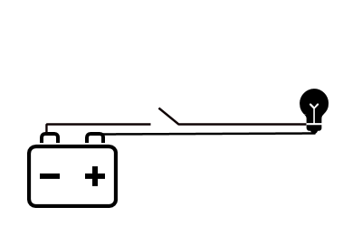
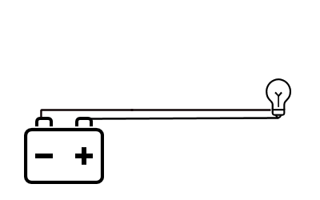
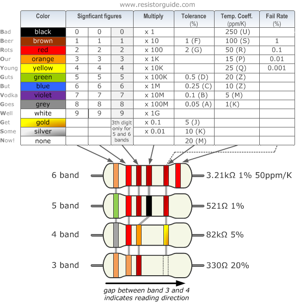
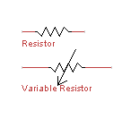
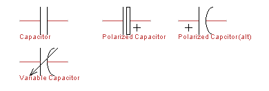
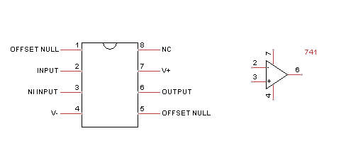
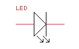
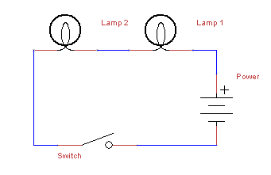
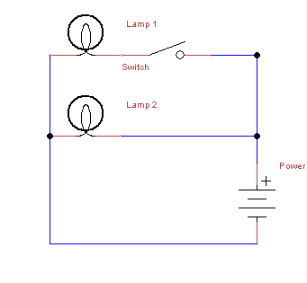
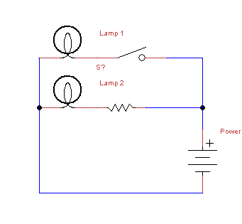
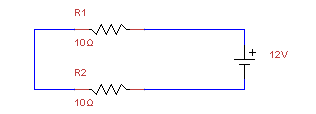
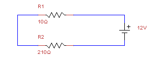
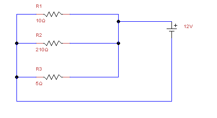
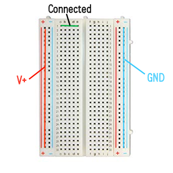

Raspberry Pi Pinouts
------------------------

Before we setup the Pi and get software installed, it’s a good idea to take a look and familiarize yourself with the location and orientation of the GPIO pins and components. Take a look at the images here:

|Raspberry Pi v3| |Raspberry Pi 0w|

Please note the orientation of the boards, the GPIO pins should be on the right of the board. The Top left pin is Pin 1. With this orientation in place, you can now reference the below image:

|PiPinout|

The numbers in the center represent the physical GPIO pins on the Raspberry Pi. The next set on either side represents BCM, these are the numbers associated with the breakout module, and other devices that use the BCM numbering system. Lastly is WiringPi, which assigns different numbers to these pins. Depending on the device, you will be asked for a BCM, WiringPi, or a GPIO pin so it is important to familiarize yourself with each of these numbering systems.

If you have a device plugged into BCM 17, it also functions as WiringPi pin 0, and GPIO pin 11.

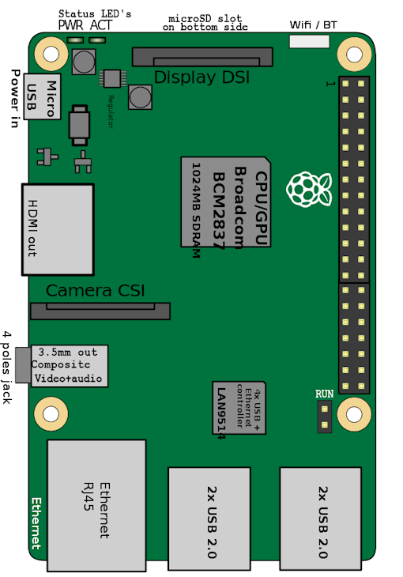
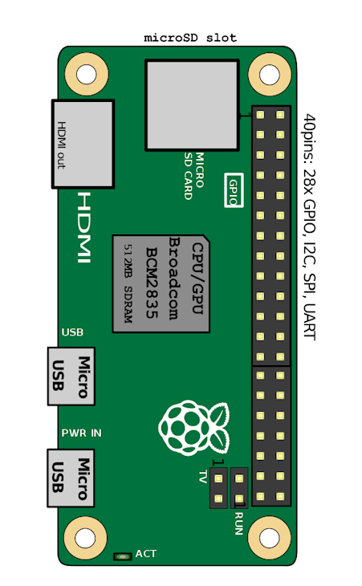
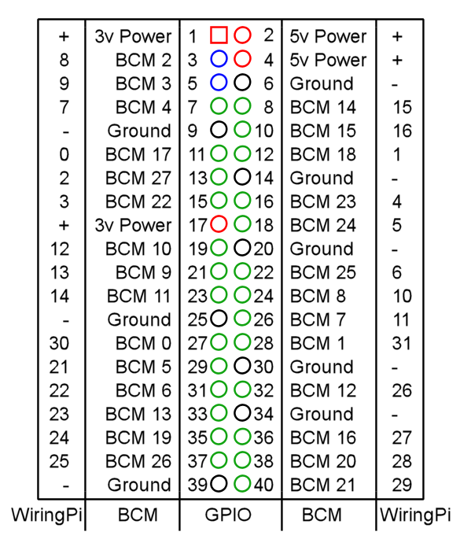

Setting Up the Raspberry Pi
-------------------------------

IoT One Cloud runs on almost any linux build, however to make things easy and have a lower footprint on memory, we are going to go with Raspbian Stretch Lite. This will require us to install some necessary software, but this is the operating system we have spent the most time working and developing with. Other guides will be made available as we expand. You can get the image of Raspbian Stretch Lite from `here <https://etcher.io/>`__ as a zip file.

Preparing the SD card
^^^^^^^^^^^^^^^^^^^^^^^^

Once you have downloaded the SD card image, we recommend obtaining a free program called `Etcher <https://etcher.io/>`__ available for all operating systems. It will burn and test any image to an SD card, saving you precious time for setting up partitions and other necessities for a Linux operating system.

Interfacing with your Pi
^^^^^^^^^^^^^^^^^^^^^^^^^^^^

Most Raspberry Pis have an HDMI or MiniHDMI port on them that you can plug into a monitor or a TV. Almost any USB keyboard will function with the Raspberry Pi as long as they do not drain too much power. Insert your SD card into the slot, then plug the monitor and keyboard in. Be sure the monitor is turned on before you plug in the USB cable to the Raspberry Pi so it can accept handshaking. After a few moments, you should be presented with a login screen.

Logging in
^^^^^^^^^^^^^

Once you start the Raspberry Pi, the operating system will be unpacked and you will be presented with a login screen. The default login is as follows: username: pi password: raspberry

once logged in, you will need to set a few things using the raspi-config utility.

::

   sudo raspi-config

The first thing to recommend is to change your password by choosing option 1. This is essential to securing your raspberry Pi device.

|Main Menu|

Follow the prompts and set your new password.

Enabling & configuring Wi-fi
^^^^^^^^^^^^^^^^^^^^^^^^^^^^^^^^

Once that is changed, you should now change the Localization options, doing this sets the region you are in for interference compliant Wi-fi. Note that Wi-fi will be disabled until you select a region. Select Localization Options, and then option 4, Change Wi-fi Country

|Rasp Local|

Now select the country you are in. You can type the first letter of the country to skip through a lot of scrolling.

|Rasp 03|

Once this is set, go into the Wi-fi configurations under Network Configuration. Here you can input the SSID and Pre-shared Key of your local network to connect.

|Rasp Wifi|

**Remember that PSK and SSID are case sensitive!!**

SSH
^^^^

If you wish to work on your Raspberry Pi without having to connect a monitor and keyboard, you can enable the SSH server to use that protocol. To do this, go into the Interfacing options, selection 5

|Rasp Interface|

Select SSH, and enable the server.

To connect to the Raspberry Pi from your local network, first boot up the machine. Then from a linux computer, or Console on a mac, or a PowerConsole like Cygwin on a windows machine, use the following command:

::

   ssh username@192.168.0.0

Where username is the name you want to login under (in our case the only user is pi), followed by the IP address of the raspberry pi. You will be prompted for a password, and then you will have logged in. It will look just the same as if you’re controlling the Raspberry Pi Directly!

.. Note::

   You can use ifconfig to see the IP of the Raspberry Pi.

Enabling Interfaces
^^^^^^^^^^^^^^^^^^^^^^

As you probably saw if you setup SSH, I2C, Remote GPIO, and 1-wire interfaces can be enabled from the raspi-config utility. If you plan on using devices on those protocols, it is suggested you turn them on at this time.

Required Libraries
^^^^^^^^^^^^^^^^^^^

Now it’s time to install the required software before setting up IoT One Cloud, luckily this is done very easily!

First, lets update the apt-get program, in case there are some new URLs and packages we need. To do this, run the following:

::

   sudo apt-get update
   sudo apt-get upgrade

|Rasp Update|

Java JDK
~~~~~~~~~~~~

Next lets install Java on the Pi. We recommend using Oracle Java v8. This can be accomplished by using the following command

::

   sudo apt-get install oracle-java8-jdk

|Rasp Install Java|

Type "y" to install the program and wait for apt-get to do it’s thing.

Once it’s finished, type ``java -version`` to test that it installed correctly. You should get a message like

::

   java version "1.8.0_65"
   Java(TM) SE Runtime Environment (build 1.8.0_65-b17)
   Java HotSpot(TM) Client VM (build 25.65-b01, mixed mode)

Pi4j
~~~~~

We use some libraries from the Pi4J project to connect Java with the GPIO pins. This must be installed for any devices that plan to use a GPIO pin, like a switch or an LED.

::

   curl -s get.pi4j.com | sudo bash

This installs the pi4j libraries on your raspberry Pi. Once installed, you can upgrade using the following command: ``pi4j --update``

IoT one Cloud can find this library automatically, no need to worry about installation location.

WiringPi
~~~~~~~~~~~

IoT One Cloud uses the WiringPi numbering system which is also required to be installed onto your system in order to access GPIO pins. Some distributions have this pre-installed. To find out if it is, run the following command:

::

   gpio -v

If you get an error like this:

::

   -bash: gpio: command not found

Continue with the next steps.

Although this takes a few more steps to compile and install, it’s still fairly easy. From the command prompt, install git-core to your system:

::

   sudo apt-get install git-core

Now use git to obtain the WiringPi source

::

   git clone git://git.drogon.net/wiringPi

This will download the source into the /wiringPi folder. Once it is finished, go into that folder and verify that you have the latest version, and then compile.

::

   cd wiringPi
   git pull origin
   ./build

Once this is done, your required libraries are setup, we recommend a reboot at this time before you begin the next steps.

::

   sudo reboot

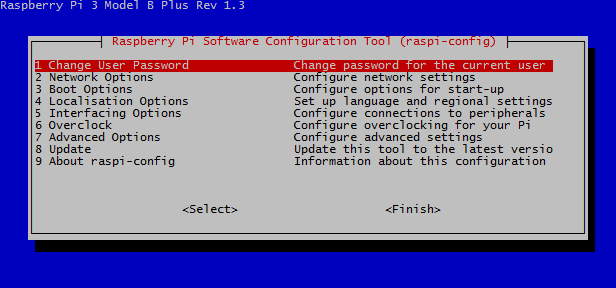
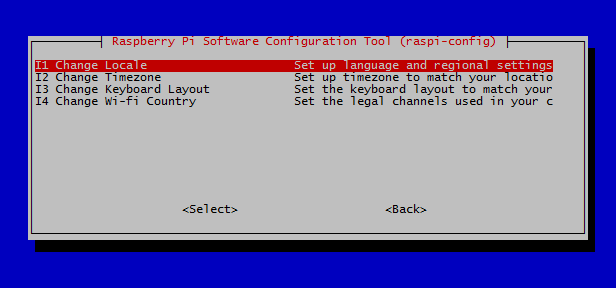
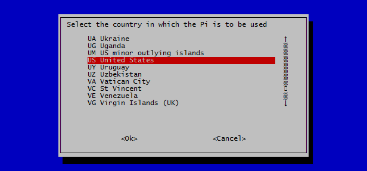
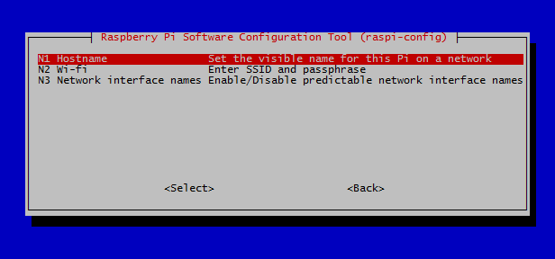
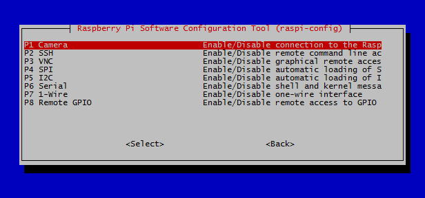
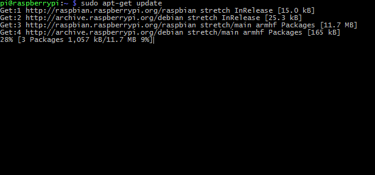
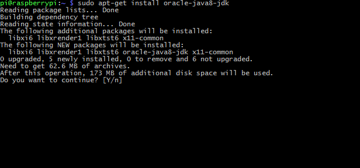

Getting Started
----------------

Installation of IoT-hub
^^^^^^^^^^^^^^^^^^^^^^^^^^^

The latest version of IoT hub is available by using wget:

::

   wget http://build.xmpp-test.net/nightlies/dists/latest/tigase-iot-hub-dist.tar.gz

Once downloaded, extract the files. It will automatically extract to a subfolder.

::

   tar -xzf tigase-iot-hub-dist.tar.gz

The folder with the version of the hub will be named in the following format: **tigase-iot-hub-x.x-SNAPSHOT-byy** where x.x is the version, and yy is the build number. These may be important for bugs and troubleshooting.

To make things simple, and to avoid typing the version we can rename the folder using the mv command.

::

   mv tigase-iot-hub-x.x-SNAPSHOT-byy iot-hub

Navigating inside, you will see the following file list:

::

   certs      database  jars          logs          README   tigase
   ChangeLog  etc       License.html  package.html  scripts  win-stuff

Selecting Java
~~~~~~~~~~~~~~~~~

Since there are many builds of Java available, we have to set the path to java manually. To do this, type the following into the command line:

::

   sudo nano etc/tigase.conf

When you press enter, you will need to edit the following line

::

   #JAVA_HOME="$(JDKPath)"

And replace it with the location of java, also remove the preceding hash so it is not ignored.

::

   JAVA_HOME="/usr/lib/jvm/jdk-8-oracle-arm32-vfp-hflt"

Press Ctrl+X, Answer Yes, and press enter to overwrite the old name.

Starting up
^^^^^^^^^^^^

Go back up one level to the main directory

::

   cd ..

From the main directory use the following command:

::

   ./scripts/tigase.sh upgrade-schema etc/tigase.conf

This is required to setup the associated database and if not run will result in the program being unable to run.

You should see a status report once everything is done:

::

   =============================================================================
         Schema upgrade finished

   Configuration file etc/config.tdsl was updated to match current format.
   Previous version of configuration file was saved as etc/config.tdsl.old

   Data source: default with uri jdbc:derby:tigase_iot;create=true
         Checking connection to database ok
         Checking if database exists     ok
         Loading Common Schema Files     ok
         Loading schema: Tigase XMPP Server (Core), version: 8.0.0-SNAPSHOT-b5214/ff351c8a (database version: none)      ok
         Loading schema: Tigase PubSub Component, version: 4.0.0-SNAPSHOT-b652/eb442404 (database version: none) ok
         Adding XMPP admin accounts      warning
                 Message: Error: No admin users entered
         Post installation action        ok
   =============================================================================

Once this process is complete, you can run the hub itself with the following command:

::

   ./scripts/tigase.sh start etc/tigase.conf

The hub is now active and running.

Now it’s time to install and start the IoT Framework.

Devices
--------

This section goes over the various devices supported by IoT One Cloud. This list will grow as new drivers are added to the software. If you are unsure about some of the symbols in the individual sections, refer to the `Circuit basics <#circuits>`__ section of this guide. Some devices might require extra tools to be setup before use, refer to this section if the device calls for it.

S2C
^^^^

S2C is a communications protocol than enabled serial communication through GPIO pins 3 and 5 known as the SDA and SDL pins. Some setup is required to enabled this communication.

First step is to install i2c tools, this makes detecting device addresses much easier. This can be accomplished by running the following command.

::

   sudo apt-get install -y i2c-tools

Next you will need to make sure I2C is enabled on the raspberry. To do this, run the following command:

::

   sudo raspi-config

You will presented with a menu screen. Select 5. Interfacing Options, and then P5, I2C. Enable this interface, exit and save configuration.

WiringPi Prerequsites
~~~~~~~~~~~~~~~~~~~~~~~~~

I2C functionality requires WiringPi to be installed on your raspberry pi. In some cases this is pre-installed. To check whether this is installed, run the following command.

::

   gpio readall

If Wiring Pi installed, you will be presented with a chart similar to the following:

::

    +-----+-----+---------+------+---+---Pi 3---+---+------+---------+-----+-----+
    | BCM | wPi |   Name  | Mode | V | Physical | V | Mode | Name    | wPi | BCM |
    +-----+-----+---------+------+---+----++----+---+------+---------+-----+-----+
    |     |     |    3.3v |      |   |  1 || 2  |   |      | 5v      |     |     |
    |   2 |   8 |   SDA.1 | ALT0 | 1 |  3 || 4  |   |      | 5v      |     |     |
    |   3 |   9 |   SCL.1 | ALT0 | 1 |  5 || 6  |   |      | 0v      |     |     |
    |   4 |   7 | GPIO. 7 |   IN | 0 |  7 || 8  | 0 | IN   | TxD     | 15  | 14  |
    |     |     |      0v |      |   |  9 || 10 | 1 | IN   | RxD     | 16  | 15  |
    |  17 |   0 | GPIO. 0 |   IN | 0 | 11 || 12 | 0 | IN   | GPIO. 1 | 1   | 18  |
    |  27 |   2 | GPIO. 2 |   IN | 0 | 13 || 14 |   |      | 0v      |     |     |
    |  22 |   3 | GPIO. 3 |   IN | 0 | 15 || 16 | 0 | IN   | GPIO. 4 | 4   | 23  |
    |     |     |    3.3v |      |   | 17 || 18 | 0 | IN   | GPIO. 5 | 5   | 24  |
    |  10 |  12 |    MOSI | ALT0 | 0 | 19 || 20 |   |      | 0v      |     |     |
    |   9 |  13 |    MISO | ALT0 | 0 | 21 || 22 | 0 | IN   | GPIO. 6 | 6   | 25  |
    |  11 |  14 |    SCLK | ALT0 | 0 | 23 || 24 | 1 | OUT  | CE0     | 10  | 8   |
    |     |     |      0v |      |   | 25 || 26 | 1 | OUT  | CE1     | 11  | 7   |
    |   0 |  30 |   SDA.0 |   IN | 1 | 27 || 28 | 1 | IN   | SCL.0   | 31  | 1   |
    |   5 |  21 | GPIO.21 |   IN | 1 | 29 || 30 |   |      | 0v      |     |     |
    |   6 |  22 | GPIO.22 |   IN | 1 | 31 || 32 | 0 | IN   | GPIO.26 | 26  | 12  |
    |  13 |  23 | GPIO.23 |   IN | 0 | 33 || 34 |   |      | 0v      |     |     |
    |  19 |  24 | GPIO.24 |   IN | 0 | 35 || 36 | 0 | IN   | GPIO.27 | 27  | 16  |
    |  26 |  25 | GPIO.25 |   IN | 0 | 37 || 38 | 0 | IN   | GPIO.28 | 28  | 20  |
    |     |     |      0v |      |   | 39 || 40 | 0 | IN   | GPIO.29 | 29  | 21  |
    +-----+-----+---------+------+---+----++----+---+------+---------+-----+-----+
    | BCM | wPi |   Name  | Mode | V | Physical | V | Mode | Name    | wPi | BCM |
    +-----+-----+---------+------+---+---Pi 3---+---+------+---------+-----+-----+

If you get this chart, proceed to Connecting the Sensor If you get a no such command error, proceed to installation instructions:

Installing WiringPi
~~~~~~~~~~~~~~~~~~~~~~

Wiring Pi requires that you install git, and then compile the code, therefore you must first install git. To do this from the command line, run the following commands. First update the pi:

::

   sudo apt-get update && sudo apt-get upgrade

Once this is finished, now install git:

::

   sudo apt-get install git git-core

Then use git to download wiringpi code:

::

   it clone git://git.drogon.net/wiringPi
   cd wiringPi
   ./build

Once this is done you can now run the gpio command and verify wiring pi is installed.

Turn off the device to plug in your sensor

::

   sudo shutdown

Locating a sensor
~~~~~~~~~~~~~~~~~~~

Once you have connected an i2C device, turn on your raspberry Pi and let it boot up. Log in and run the following command

::

   i2cdetect -y 1

You will presented with a map like the following:

::

        0  1  2  3  4  5  6  7  8  9  a  b  c  d  e  f
   00:          -- -- -- -- -- -- -- -- -- -- -- -- --
   10: -- -- -- -- -- -- -- -- -- -- -- -- -- -- -- --
   20: -- -- -- 23 -- -- -- -- -- -- -- -- -- -- -- --
   30: -- -- -- -- -- -- -- -- -- -- -- -- -- -- -- --
   40: -- -- -- -- -- -- -- -- -- -- -- -- -- -- -- --
   50: -- -- -- -- -- -- -- -- -- -- -- -- -- -- -- --
   60: -- -- -- -- -- -- -- -- -- -- -- -- -- -- -- --
   70: -- -- -- -- -- -- -- --

This polls bus 1 of the i2c system, which is the one the model 3 uses.

Devices connected using i2c will be listed in this screen. In this case a device is connected at address 23.

If you do not see a connected device, it may not be getting enough power, or your wiring may not be correct. Please check and retry this step.

Error from i2cdetect
~~~~~~~~~~~~~~~~~~~~~~~

If you result in this error:

::

   Error: Could not open file `/dev/i2c-1' or `/dev/i2c/1': No such file or directory

You are likely using an older model such as the model 1 and 2 and will need to check bus 0

::

   i2cdetect -y 0

Connecting Multiple Devices
~~~~~~~~~~~~~~~~~~~~~~~~~~~~~~~~~

Since S2C works off two pins, it is possible to connect multiple devices at different addresses. In order to do this, both devices must be powered individually, with each wire, SDA, and SCL being connected in Parallel.

1wire Devices
^^^^^^^^^^^^^^^

DHTXX Devices
^^^^^^^^^^^^^^^^^

Some devices may require the DHTXX library installed and running. To do this, follow these steps to prepare.

Get the pigpio library and install it

::

   sudo apt-get install pigpio python-pigpio python3-pigpio

Then download DHTXXD into a directory

::

   mkdir DHT22
   cd DHT22
   http://abyz.me.uk/rpi/pigpio/code/DHTXXD.zip

unzip the DHTXXD.zip file

::

   unzip DHTXXD.zip

Compile the DHTXXD

::

   gcc -Wall -pthread -o DHTXXD test_DHTXXD.c DHTXXD.c -lpigpiod_if2

once done, the program DHTXXD will be available in this directory: /home/pi/DHT22/DHTXXD **Remember this, you will need to recall this for later.**

Now connect the DHT22 as shown 

GPIO Library
~~~~~~~~~~~~~~

Before getting data from the some devices, you will need to install the PIGPIO library. To do this, run the commands

::

   sudo apt-get install pigpio python-pigpio python3-pigpio

This will install the PIGPIO library into your Raspberry Pi. Start the daemon by running

::

   sudo pigpiod

This must be done manually at every boot, unless you enable the daemon to run at boot. This can be done by using the following command at the command line:

::

   sudo systemctl enable pigpiod

This will now run at every boot, now reboot your system.

``sudo reboot``

A Note about connections
~~~~~~~~~~~~~~~~~~~~~~~~~~~~~

In some cases the DHT sensors might not receive enough power from the breakout board or ribbon cables. You may test to see if the sensor is getting power and delivering information by running the DHTXXD program directly. From the directory you compiled it in, run

::

   ./DHTXXD -g17

where -g## is the BCM pin 17 for the device, and you should return some data.

::

   0.25.0.18.0

If you get the result

::

   3.0.0.0.0

Your device is not communicating and you may need to change how it is hooked up. You may need to bypass the ribbon cable, or use another +3.3v power source. Note that devices like DHT22 and DHT11 require 2.5mA max current to poll data.

BH1750 Ambient Light Sensor
----------------------------

Details
^^^^^^^^^^^

The BH 1750 ambient light sensor operates on the S2C protocol which much be setup before using this device. Review `this section <#s2C>`__ for setup.

While the Pi is powered down, connect the sensor like the following diagram:

|BH1750|

Once you’ve connected the device and booted, now proceed to add the sensor from Light Sensor → BH1750

|BH1750Screen|

Note that the Address and Bus are separate entries. Be sure that you select the proper address as displayed in the graph. If you are not sure, you can run the i2i2cdetect command and see what the graph says:

::

   i2cdetect -y 1

::

   0  1  2  3  4  5  6  7  8  9  a  b  c  d  e  f
   00:          -- -- -- -- -- -- -- -- -- -- -- -- --
   10: -- -- -- -- -- -- -- -- -- -- -- -- -- -- -- --
   20: -- -- -- 23 -- -- -- -- -- -- -- -- -- -- -- --
   30: -- -- -- -- -- -- -- -- -- -- -- -- -- -- -- --
   40: -- -- -- -- -- -- -- -- -- -- -- -- -- -- -- --
   50: -- -- -- -- -- -- -- -- -- -- -- -- -- -- -- --
   60: -- -- -- -- -- -- -- -- -- -- -- -- -- -- -- --
   70: -- -- -- -- -- -- -- --

In our example it is 23 on bus 1.

Once added, the client will display how many Lux the sensor is being exposed too:

|BH1750Final|

A Note about connections
^^^^^^^^^^^^^^^^^^^^^^^^^^^

In some cases the BH1750 sensor might not receive enough power from the breakout board or ribbon cables. i2cdetect will show devices if they are receiving enough power, however if none is shown, or you get an entry of 00 someplace in the matrix, your device might not have enough power to run.

Specifications
^^^^^^^^^^^^^^^^^^

.. table:: Table 1. Specifications

   +-----------------+--------------+
   | Field           | Range        |
   +=================+==============+
   | Power           | +3v-5v DC    |
   +-----------------+--------------+
   | Lux Sensitivity | 1 - 65535 lx |
   +-----------------+--------------+
   | Lux Accuracy    | +/- 20%      |
   +-----------------+--------------+

Lux reference
^^^^^^^^^^^^^^

Here is a small chart from Wikipedia that provides some reference for the Lux unit.

Source: Wikipedia (https://en.wikipedia.org/wiki/Lux)

+-------------------+------------------------------------------------+
| Illuminance (lux) | Surfaces illuminated by                        |
+===================+================================================+
| 0.0001            | Moonless, overcast night sky (starlight)       |
+-------------------+------------------------------------------------+
| 0.002             | Moonless clear night sky with airglow          |
+-------------------+------------------------------------------------+
| 0.05–0.3          | Full moon on a clear night                     |
+-------------------+------------------------------------------------+
| 3.4               | Dark limit of civil twilight under a clear sky |
+-------------------+------------------------------------------------+
| 20–50             | Public areas with dark surroundings            |
+-------------------+------------------------------------------------+
| 50                | Family living room lights                      |
+-------------------+------------------------------------------------+
| 80                | Office building hallway/toilet lighting        |
+-------------------+------------------------------------------------+
| 100               | Very dark overcast day                         |
+-------------------+------------------------------------------------+
| 150               | Train station platforms                        |
+-------------------+------------------------------------------------+
| 320–500           | Office lighting                                |
+-------------------+------------------------------------------------+
| 400               | Sunrise or sunset on a clear day               |
+-------------------+------------------------------------------------+
| 1000              | Overcast day, typical TV studio lighting       |
+-------------------+------------------------------------------------+
| 10,000–25,000     | Full daylight (not direct sun)                 |
+-------------------+------------------------------------------------+
| 32,000–100,000    | Direct sunlight                                |
+-------------------+------------------------------------------------+

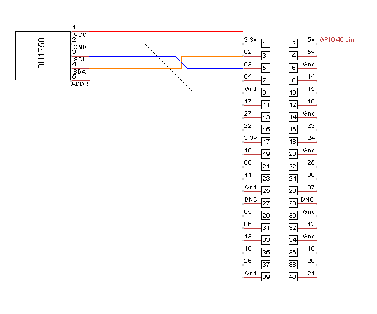
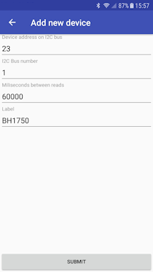
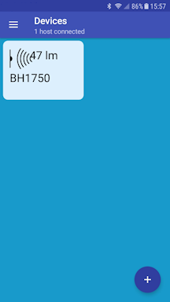

DHT22 & DHT11 Devices
----------------------

IoT One Cloud has support for DHT11 and DHT22 devices to be used to sample both Humidity and Temperature. Note that these devices require the DHTXX and PIGPIOD programs to be installed and running. Visit `this section <#dHTXX>`__ for details on how to setup.

Now connect the DHT22 as shown

|DHT22 Wiring diagram|

Note that there is a 10k resistor between power and data lines, this is to add some current to the data line in order for it to be delivered. It may not work properly otherwise.

Before adding the device to the hub with your client, you may wish to ensure correct connections and data. To do this, visit `DHTXX Device Testing <#dHTEST>`__.

Add DHT22 to hub
^^^^^^^^^^^^^^^^^

Now add the DHT22 device, either through temperature or humidity sensor screens. You will see something similar to the following:

|DHT22screen|

Note you must fill out the path to the DHT22 compiled program, as done in the example from `device setup <#dHTXX>`__. /home/pi/DHT22/DHTXXD

Further, be sure to put the BCM pin number where data is connected. This is the number from the breakout module(BCM), not the specific GPIO pin it’s plugged into.

Once these are uploaded, you will see the temperature sensor delivering information as shown:

|DHT22Final|

DHT11 and DHT22
^^^^^^^^^^^^^^^^^

Tigase IoT One Cloud is compatible with the DHT11 and DHT22 devices, they are similar and will both provide the same information however, the DHT22 provides slightly more accurate results, and allows for more frequent data transmission.

+----------------------+--------+---------+
| Field                | DHT11  | DHT22   |
+======================+========+=========+
| Temp range           | 0-50C  | -40-80C |
+----------------------+--------+---------+
| Temp Accuracy        | +/- 2C | +/- .5C |
+----------------------+--------+---------+
| Humidity range       | 20-80% | 0-100%  |
+----------------------+--------+---------+
| Humidity Accuracy    | 5%     | 2-5%    |
+----------------------+--------+---------+
| Max Data Sample Rate | 1 Hz   | .5 Hz   |
+----------------------+--------+---------+

Temperature and Humidity
^^^^^^^^^^^^^^^^^^^^^^^^^^

The same sensor can be used for both Temperature and Humidity samplings, and you may setup 2 devices on the same pin to poll both.

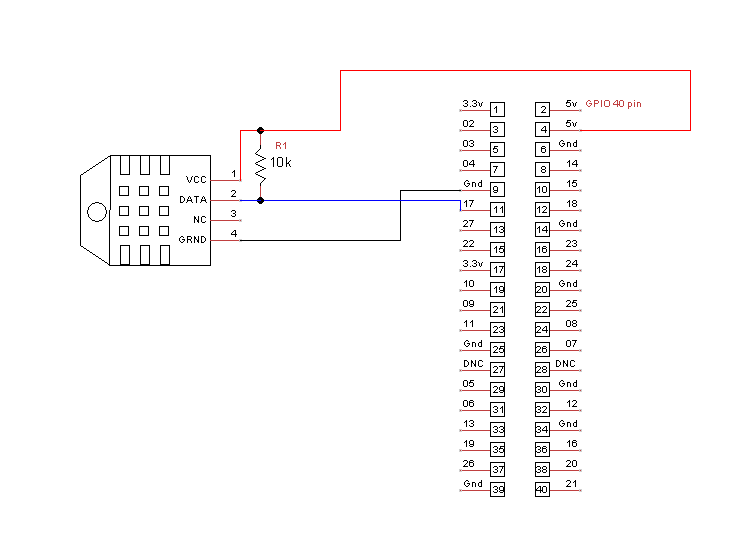
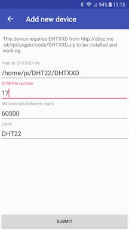
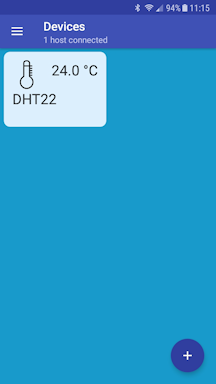

BMP180 & BMP280 Ambient Pressure Sensors
-----------------------------------------

The BMP180 and BMP280 air pressure sensors operates on the S2C protocol which much be setup before using this device. To do this, visit `this section <#i2C>`__.

Connecting the Sensor - BMP280
^^^^^^^^^^^^^^^^^^^^^^^^^^^^^^^^^

Use the following wiring diagram to connect your device. Note that SDI and SCK MUST be connected to pins 3 and 5 as I2C devices must communicate on those pins.

|BMP280 Wiring Diagram|

Connecting the Sensor - BMP180
^^^^^^^^^^^^^^^^^^^^^^^^^^^^^^^^^^^

Use the following wiring diagram to connect your device. Note that SCL and SDA MUST be connected to pins 3 and 5 as I2C devices must communicate on those pins.

|BMP180 Wiring Diagram|

Detecting and working with your device
^^^^^^^^^^^^^^^^^^^^^^^^^^^^^^^^^^^^^^^^^^

Both the BMP180 and 280 sensors will work in a similar fashion, for either sensor, you may following the next instructions.

Turn on your raspberry Pi and let it boot up. Once you are logged in, run the following command

::

   i2cdetect -y 1

You will presented with a map like the following:

::

        0  1  2  3  4  5  6  7  8  9  a  b  c  d  e  f
   00:          -- -- -- -- -- -- -- -- -- -- -- -- --
   10: -- -- -- -- -- -- -- -- -- -- -- -- -- -- -- --
   20: -- -- -- -- -- -- -- -- -- -- -- -- -- -- -- --
   30: -- -- -- -- -- -- -- -- -- -- -- -- -- -- -- --
   40: -- -- -- -- -- -- -- -- -- -- -- -- -- -- -- --
   50: -- -- -- -- -- -- -- -- -- -- -- -- -- -- -- --
   60: -- -- -- -- -- -- -- -- -- -- -- -- -- -- -- --
   70: -- -- -- -- -- -- -- 77

This polls bus 1 of the i2c system, which is the one the model 3 uses.

Devices connected using i2c will be listed in this screen. In this case a device is connected at address 77.

Error from i2cdetect
~~~~~~~~~~~~~~~~~~~~~~

If you result in this error:

::

   Error: Could not open file `/dev/i2c-1' or `/dev/i2c/1': No such file or directory

You are likely using an older model such as the model 1 and 2 and will need to check bus 0

::

   i2cdetect -y 0

Adding the Sensor
^^^^^^^^^^^^^^^^^^^^^^

Once you’ve connected the device and booted, now proceed to add the sensor from Light Sensor → BH1750

|BMP280Screen|

Note that the Address and Bus are separate entries. Be sure that you select the proper address as displayed in the graph. In our example it is 77 on bus 1.

Once added, the client will display the ambient air pressure in hectopascals (hPa).

A Note about connections
^^^^^^^^^^^^^^^^^^^^^^^^^^^

In some cases the BMP280 sensor might not receive enough power from the breakout board or ribbon cables. i2cdetect will show devices if they are receiving enough power, however if none is shown, or you get an entry of 00 someplace in the matrix, your device might not have enough power to run.

BMP180 and BMP280
^^^^^^^^^^^^^^^^^^

Tigase IoT One Cloud is compatible with the BMP180 and BMP280 devices, they are similar and will both provide the same information however, the BMP280 provides slightly more accurate results.

+-------------------+--------------+--------------+
| Field             | BMP180       | BMP280       |
+===================+==============+==============+
| Temp range        | -40-85C      | -40-85C      |
+-------------------+--------------+--------------+
| Temp Accuracy     | +/- 1C       | +/- 1C       |
+-------------------+--------------+--------------+
| Pressure range    | 300-1100 hPa | 300-1100 hPa |
+-------------------+--------------+--------------+
| Pressure Accuracy | +/- 1hPa     | +/- 0.12hPa  |
+-------------------+--------------+--------------+
| Max Sampling Rate | 1Hz          | 1Hz          |
+-------------------+--------------+--------------+

Pressure and Temperature
^^^^^^^^^^^^^^^^^^^^^^^^^^^^^

The same sensor can be used for both Temperature and Pressure samplings, and you may setup 2 devices on the same pin to poll both.

Hectopascals and other units
^^^^^^^^^^^^^^^^^^^^^^^^^^^^^^^^

Hectopascals are essentially identical to Millibar in terms of atmospheric pressure, so they can be considered a 1:1 conversion ratio. If you wish to convert hectopascals to Pounds per Square Inch, or PSI multiply your number by 0.0145038.

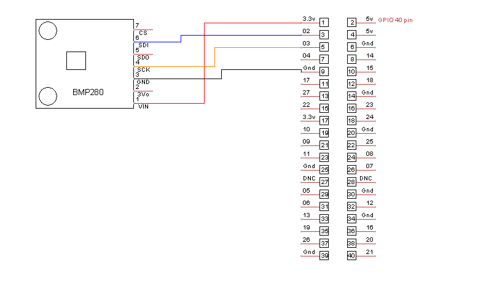
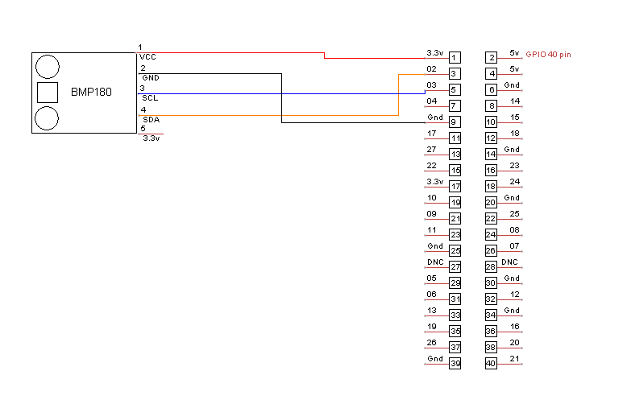
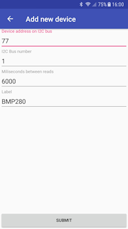

DS1820 Temperature Sensor
--------------------------

The DS1820 and DS1820B are 1-wire equipped temperature sensors. There are two common forms for the Sensor. One is a single probe with three wires, the other comes in a transistor-like form.

You can enable the 1-wire interface by using the ``sudo rasbi-config`` utility and enabling it from interfacing options.

Connecting the sensor is easy, as 1-wire will function through any GPIO pin. Note that you will need to use a 4.7kΩ resistor connected between data and Positive voltage. Further, make sure you are delivering 5v to the device or it may not function properly.

Here is the wiring diagram for the Probe type device:

|DS1820|

And this is for the transistor type:

|DS1820D|

Note that the pins here are oriented with the FLAT side of the transistor facing you.

Testing 1-wire devices
^^^^^^^^^^^^^^^^^^^^^^^^^^

If you want to test to make sure the device works, run the following commands:

::

   sudo modprobe w1-gpio
   sudo modprobe w1-therm

This will setup GPIO pin 4 for data transfer, and setup a thermometer there so make sure it’s connected like it is in the block diagrams.

Then go into the folder housing these devices:

::

   cd /sys/bus/w1/devices/

Now, use the ``ls`` command to list devices connected to 1-wire. You should see something like this:

::

   00-100000000000  28-04165af9d3ff  w1_bus_master1

This shows there is an active device. If you only see 0’s for devices, like this:

::

   00-600000000000  00-a00000000000  00-e00000000000  w1_bus_master1

The Pi cannot see your 1-wire device, check your wiring and try again!

Now go into the directory of your device, it may be unique from the one in the example.

::

   cd 28-04165af9d3ff

Once in this directory, you can run ``cat w1_slave``. The sensor writes to w1_slave file, and so this command will display it, you should see some output similar to this:

::

   d2 01 4b 46 7f ff 0c 10 fc : crc=fc YES
   d2 01 4b 46 7f ff 0c 10 fc t=29125

Adding the Device
^^^^^^^^^^^^^^^^^^^^^

Bring up your client, and tap the add new device button and select the host you are connected too.

|Select Temperature Sensor|

|Select DS1820|

|DS1820 And 03|

Now select the device, it should automatically select one for you if you have a single device. Select polling interval, and give it a friendly name if you wish. Tap submit and you will see the device showing you the current temperature.

|DS1820 And 04|

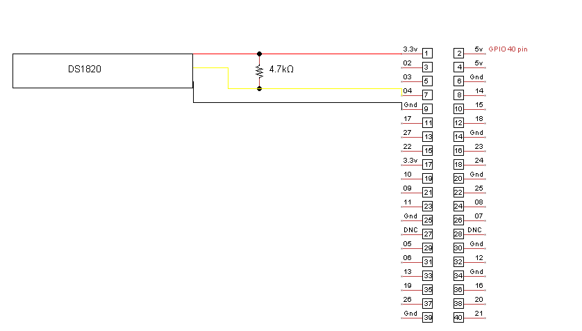
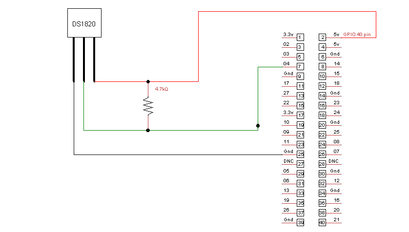
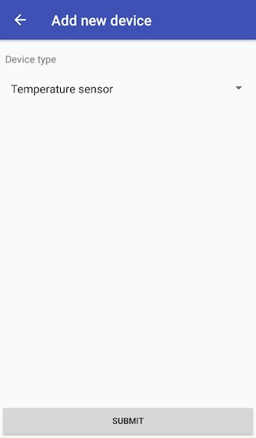
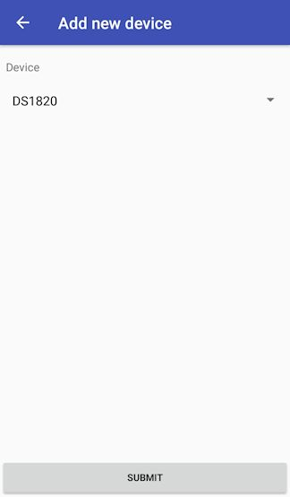
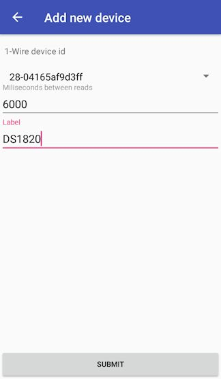
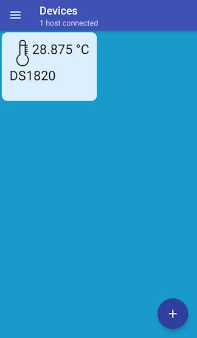

HC-SR501 Motion Detector
----------------------------

The HC-SR501 Motion detector board requires no special setup to operate on Tigase IoT One Cloud, however take note that there are controls on the board.

.. Note::

   This device requires the Pi4J and WiringPi libraries to be installed.

Here is a brief overview from the underside.

|Underside of the device|

GND: Connect to ground High/Low Output: Connect to desired pin +Power: Connect to +5v

See the wiring diagram for a sample wiring:

|Wiring Diagram|

Controls:
^^^^^^^^^^

Jumper Set:

-  H: Repeat Trigger In this mode, the motion detector will send a high signal whenever motion is detected, and it will reset after the time delay.

-  L: Single Trigger In this mode they motion detector will provide a high output signal when motion is detected, but will remain on until the device is reinitialized.

Pots:

-  Sensitivity Adjust Adjust this to change how far away the device will sense motion

-  Time Delay Adjust Adjust how long should the sensor wait between reset between 300 and 5 seconds.

**Note that this device takes approximately one minute to initialize after applying power.**

Be sure to select the wiringPi pin you are selecting when adding this device.

Adding the device
^^^^^^^^^^^^^^^^^^

Tap add a device, and select Motion Sensor from the dropdown list.

|HCSR501 01|

For now there is only the HCSR501 device available, so select that.

|HCSR501 02|

Now configure the WiringPi pin it’s plugged into, it’s name, and the polling interval.

|HCSR501 03|

You now have the motion sensor setup!

|HCSR501 04|

It will display True or False if there is motion or not within the interval. Note that it will take some time to initialize so you may see — as it has not reported any data yet.

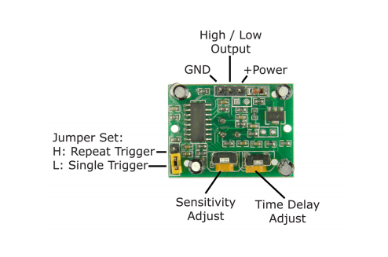
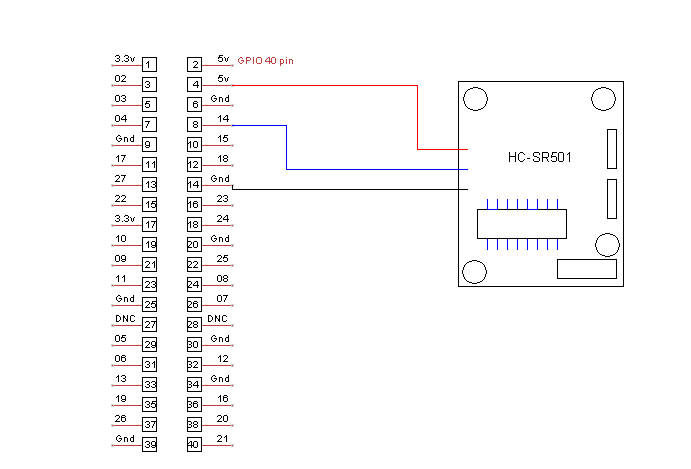
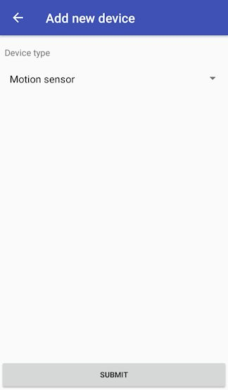
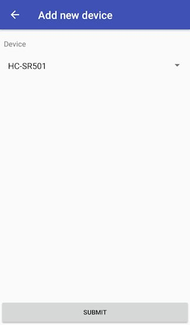
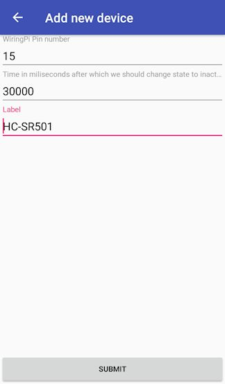
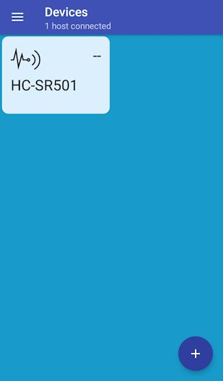

LED Matrix
-----------

The LED matrix currently supported is a 8x16 LED cold cathode matrix available `at this location <https://www.waveshare.com/rpi-led-matrix.htm>`__.

This matrix uses the MAX7219 driver IC to draw each 8x8 matrix and is powered by the 5.5v and 3.3v rails from the raspberry pi. This requires a direct connection to 24 GPIO pins.

This device requires the SPI protocol to be enabled. To enable this, type

::

   sudo raspi-config

select Interfacing Options, then SPI, and enable. Now shut down the raspberry pi and connect the matrix.

::

   sudo shutdown

Once your pi is running, be sure to run the framework with sudo, otherwise it will not function properly with this device.

::

   sudo ./bin/tigase-iot-framework

When you are up and running, now grab your smart phone and follow these steps.

Add led matrix device in your mobile client:

|android main empty|

Select board where led matrix is connected:

|android select board|

Select "LED Matrix" device:

|android select device|

Tap on added device:

|android main device|

You will see empty led matrix:

|android ledmatrix empty|

Now you can draw on led matrix what you want:

|android ledmatrix image|

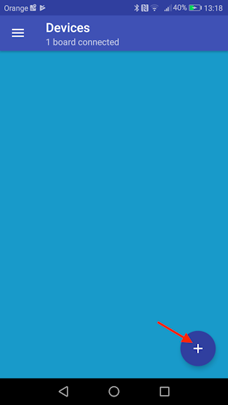
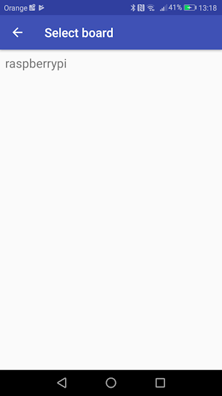
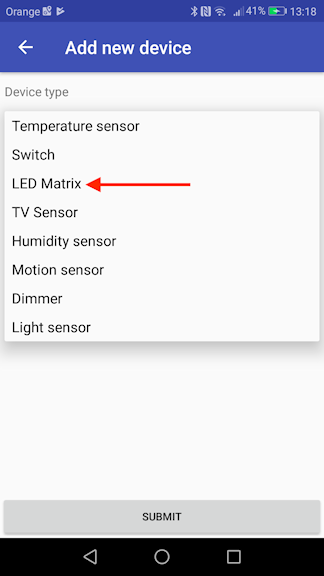
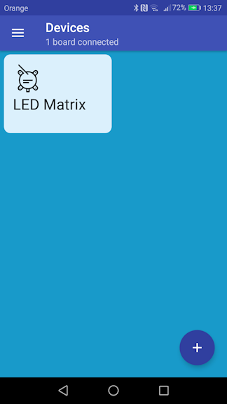
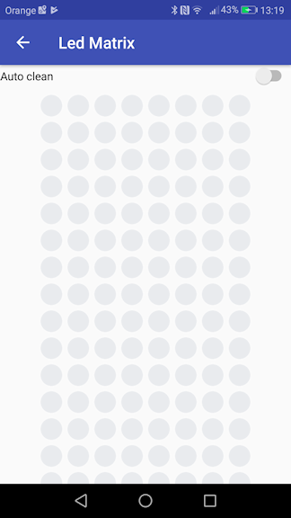

